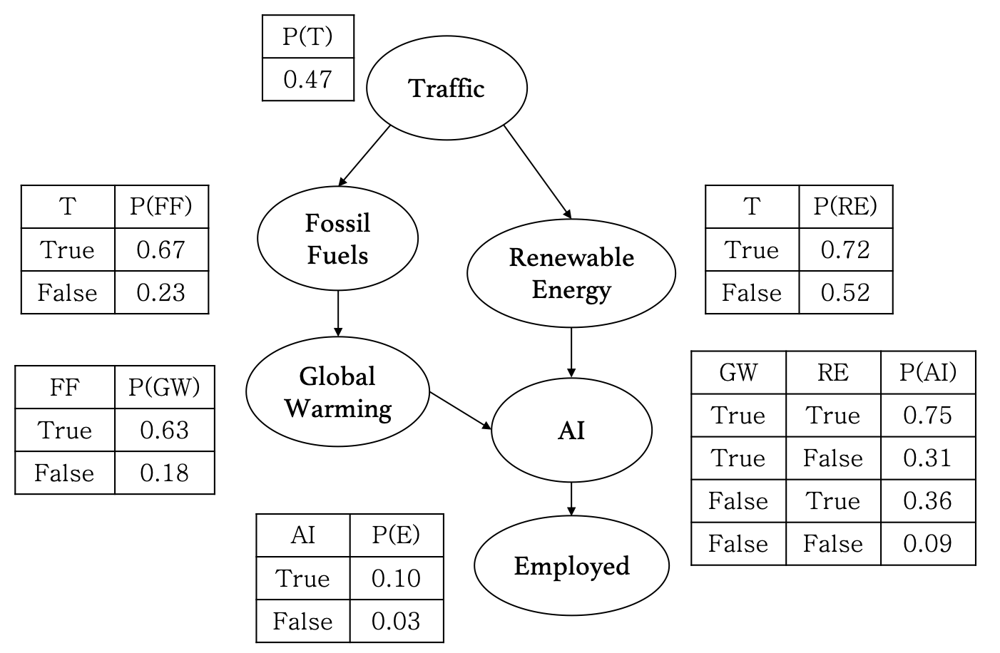

Some examples of reasoning in Knowledge Representation.

## Inference with Bayesian Networks

Example:

What is the probability that there isn't any traffic, and fossil fuel consumption is above the average, and global warming indicators aren't showing a red flag, and charging stations using renewal energy are running out of battery, and there's a new AI job posted, and no one of our community is getting employed for a new AI role. 

Using the above definition of our world and the Join Probability Distribution (JPD) we can say that there's a tiny 0.75% probability of all these events happening together.

## Learning with Naive Bayes

Analysis of Naive Bayes from a probabilistic perspective on famous datasets Breast Cancer Wisconsin originally created by Dr. William H. Wolberg. and Tic-Tac-Toe Endgame by David W. Aha.

- Conditional independence 
- Laplace Smoothing
- Multinomial vs Bernoulli distribution

